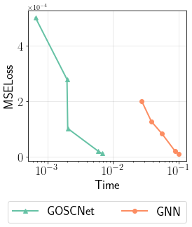
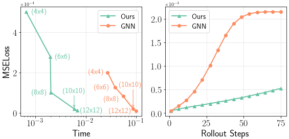
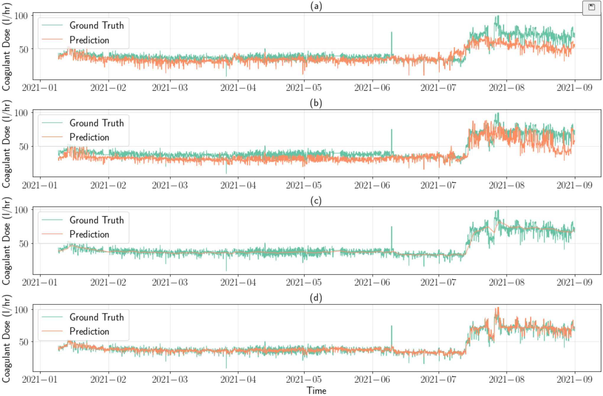
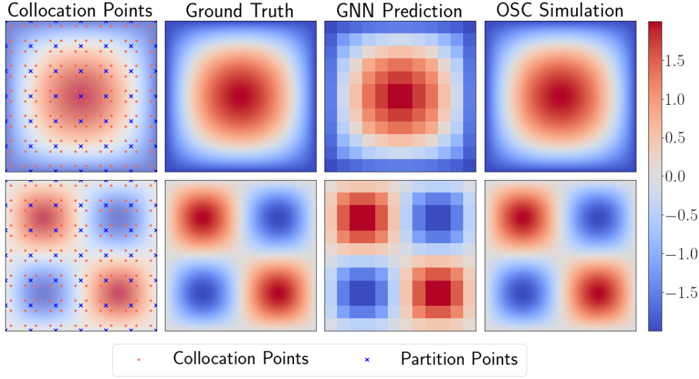
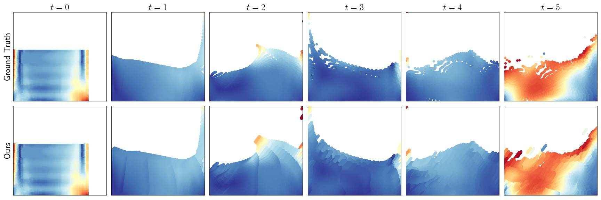
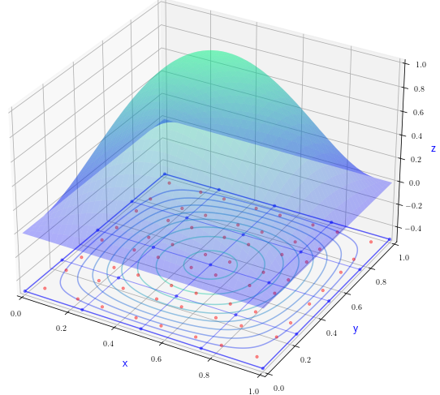
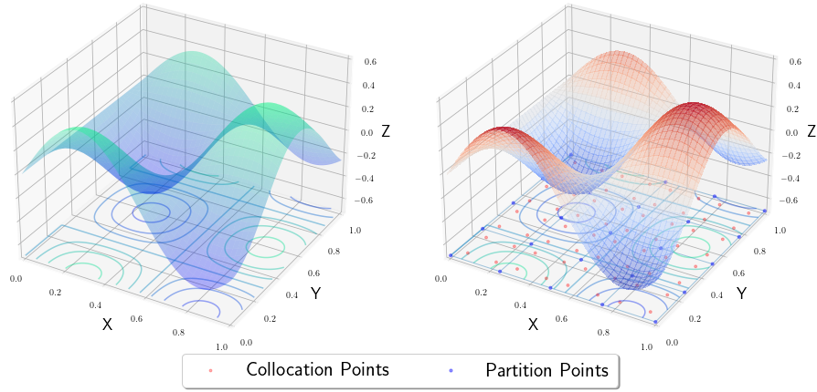
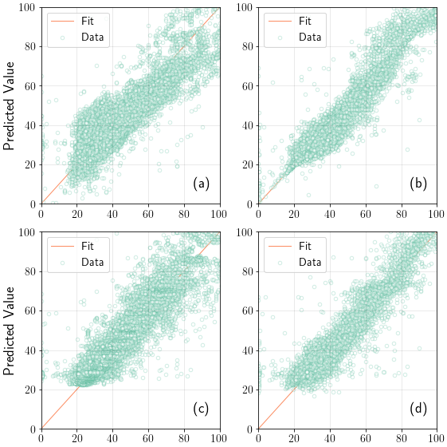
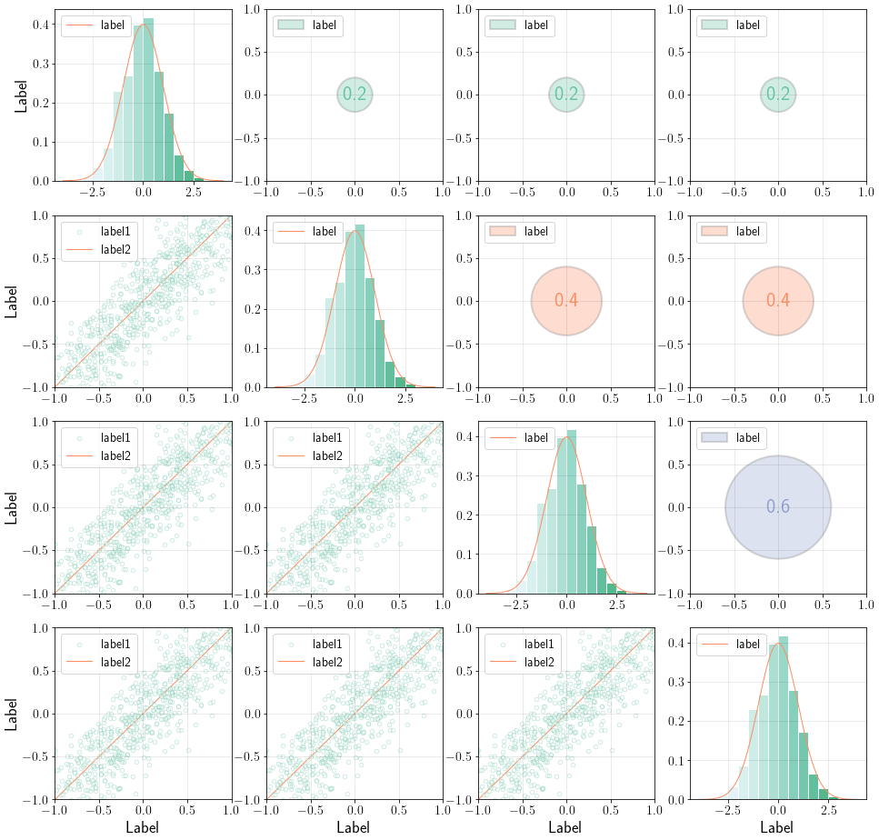

## 📈 Matplotlib Prefab

Matplotlib Prefab is a repository based on matplotlib package, which provides several pretty matplotlib ploting templates for *line plot*, *scatter plot*, etc. 

### 💡 Introduction

Of course we want to have **pretty figures** in our publications. I always try to find beautiful matplotlib templates everywhere to refer. After a long time I gradually find my plotting style, so I clean up my matplotlib plotting files to create this repository contains several prefabs. Hope they can give you ideas or tricks to make a beautiful matplotlib figure. For visualizaiton examples, please refer to the [example section](#visualization-example). 

Btw this repository is not a python package so it doesn't have APIs. To use this repository you may have to copy from source code. We do have plan to make it to be a light python package in the future updating but we know that would be a big project and there are already many similar packages ([seaborn](https://github.com/mwaskom/seaborn), [proplot](https://github.com/proplot-dev/proplot), etc.). If you are interested at contributing to this repository, welcome to [contact](#contact) us!

### ⚙️ Environment

```
Python Version: 3.6 (tested), 3.9 (tested)
Python Package: matplotlib (support Latex text), numpy, torch
Other: to use the Latex illustration style, the Latex is required to be installed
```

### 🔧 Structure

```
.
├── prefeb/
│   └── *
├── src[TODO]/
│   └── *
└── README.md
```

- `prefeb`: prefab files organized by figure type;
- `src`: [TODO] callable plotting functions source code;

### 🔦 How to start

Before you start, you may have to check if you installed the Latex, when you want to use the Latex illustration style. If you don't want to use it, set the `plt.rcParams.update({'text.usetex': True})` to `False`.

Now this repository doesn't contain APIs to call, so you may have to directly refer to the prefab source code in the `prefeb` folder. The visulization examples are shown in the [example section](#visualization-example). For example, when we refer to the prefab file `prefeb/single1d.py`:

```python
import matplotlib.pyplot as plt
...

# Font setup
title_font = {'family': 'Arial Black', 'fontsize': 18, 'fontweight': 'bold'}
...

# Data
...

# Plot
fig, axs = plt.subplots(1, figsize=(4, 4))
...
axs.grid(axis='both', color='black', alpha=0.1)
axs.tick_params(axis='both', which='major', labelsize=18)

# Set label fontfamily 
labels = axs.get_xticklabels() + axs.get_yticklabels()
[label.set_fontname('serif') for label in labels]

# Set legned location (if put the legend outside the fig)
handles, labels = axs.get_legend_handles_labels()
fig.legend(handles, labels, loc='lower center', ncol=int(len(labels)/1), bbox_to_anchor=(0.5, -0.15), prop=legend_font)
...
```

Most prefabs contain 4 parts: *packages and fontfamily setup*, *data init*, *plot* and *save*. We comment each part reflect to the figure items for your customization. This may require some basic knowledge about the `matplotlib`. 

<a id="visualization-example"></a>
### 🖼 Visualization Example

1. **Single Line Figure** `prefab/single1d.py` [Link to prefab](https://github.com/cbhua/matplotlib-prefab/blob/main/prefab/single1d.py)
   - Scientific notation
   - Axis scale (log, linear, etc)
   - Out box legend
   
2. **Multi Line Figure Horizon Order** `prefab/multi1d_h.py` [Link to prefab](https://github.com/cbhua/matplotlib-prefab/blob/main/prefab/multi1d_h.py)
   - Scientific notation
   - Axis scale (log, linear, etc)
   - Mark text in the figure
   
3. **Multi Line Figure Vertical Order** `prefab/multi1d_v.py` [Link to prefab](https://github.com/cbhua/matplotlib-prefab/blob/main/prefab/multi1d_v.py)
   - Date x axis
   
4. **Multi 2D Figure (Matrix Format)** `prefab/multi2d_1.py` [Link to prefab](https://github.com/cbhua/matplotlib-prefab/blob/main/prefab/multi1d_1.py)
   - Customized shared colorbar
   - Out box legend
   
5. **Multi 2D Figure (Scatter Format)** `prefab/multi2d_2.py` [Link to prefab](https://github.com/cbhua/matplotlib-prefab/blob/main/prefab/multi2d_1.py)
   - Cool!
   - Adaptive scatter color
   
6. **Single 3D Figure** `prefab/single3d.py` [Link to prefab](https://github.com/cbhua/matplotlib-prefab/blob/main/prefab/single3d.py)
   - Contour line
   - Scatter and customize line 
   
7. **Multi 3D Figure** `prefab/multi3d.py` [Link to prefab](https://github.com/cbhua/matplotlib-prefab/blob/main/prefab/multi3d.py)
   - Contour line
   - Scatter and customize line 
   - Out box legend
   
8. **Multi 2D Scatter Figure (Simple Version)** `prefab/scatter_1.py` [Link to prefab](https://github.com/cbhua/matplotlib-prefab/blob/main/prefab/scatter_1.py)
   - Transparent scatter point
   - In box title
   - Standard line in the figure
   
9. **Multi 2D Scatter Figure (Plentiful Version)** `prefab/scatter_2.py` [Link to prefab](https://github.com/cbhua/matplotlib-prefab/blob/main/prefab/scatter_2.py)
   - Transparent scatter point & hist bars
   - Standard line in the figure
   - Value circle 
    

<a id="contact"></a>
### 📬 Contact

If you have any question or find any bug, feel free to raise an issue. If you have ideas to contribute to this repo, welcome to pull request or contact cbhua@kaist.ac.kr. Thanks for interested to our work!

## What we need:

1. Single line plot
2. Multi line plot
- Single scatter plot
- Multi scatter plot
- Single hist plot
- Multi hist plot
3. Single matshow plot
4. Multi matshow plot
5. Single 3D plot
6. Multi 3D plot
