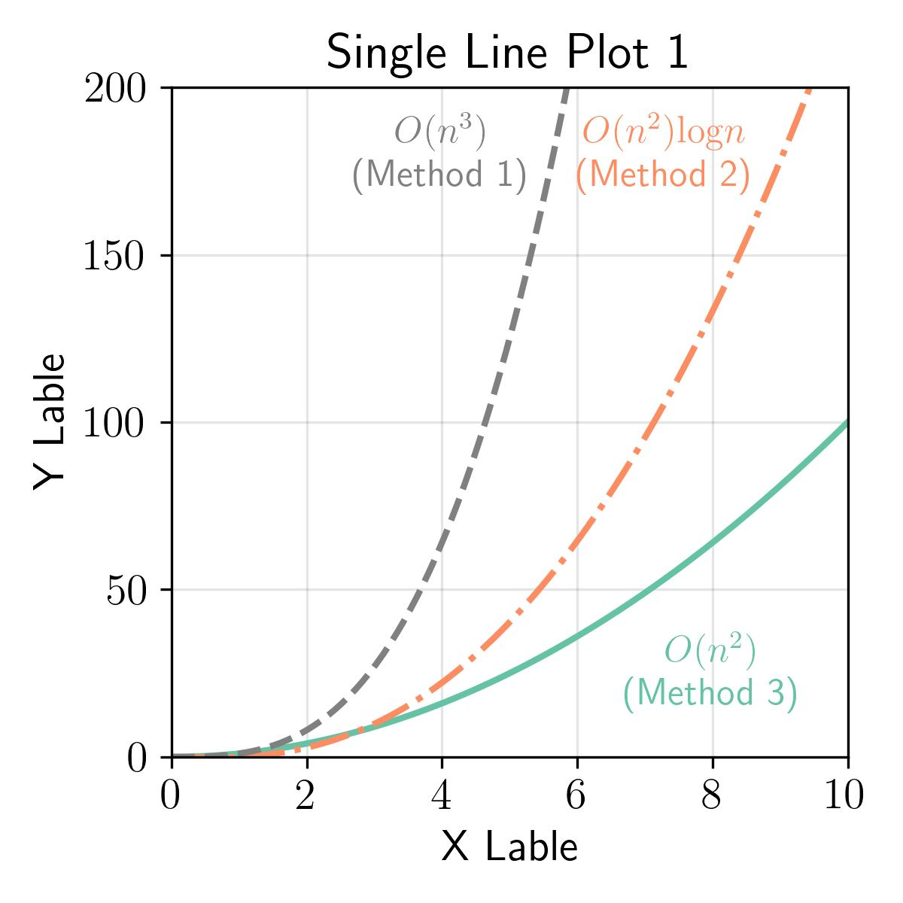
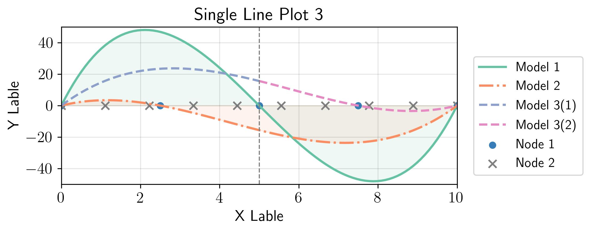
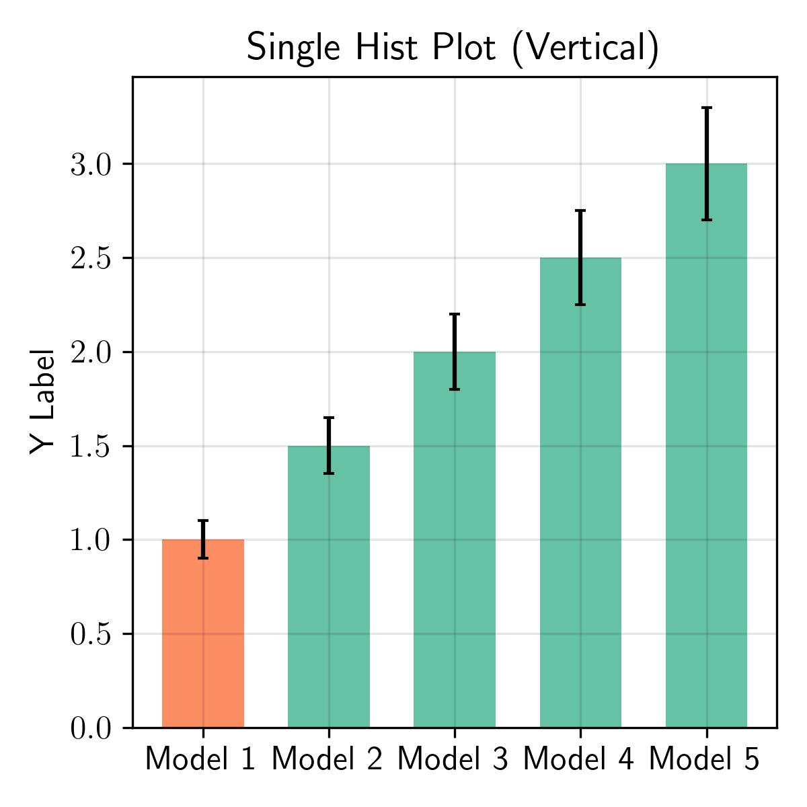
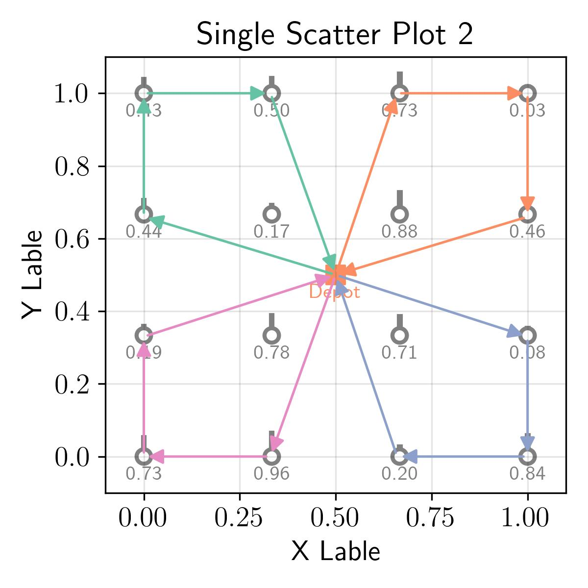
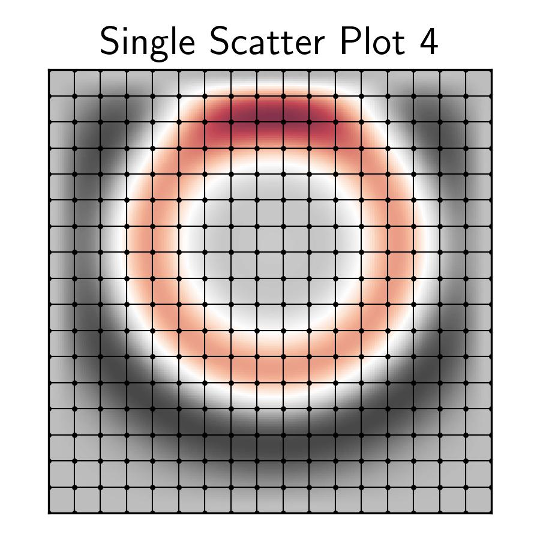
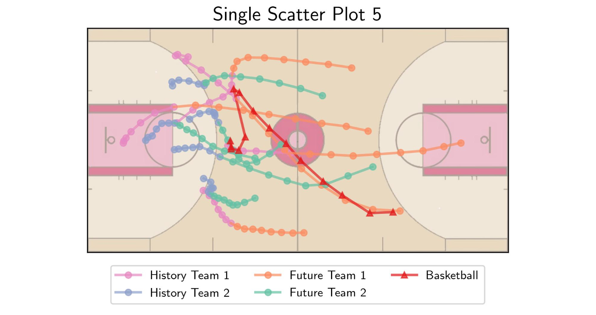
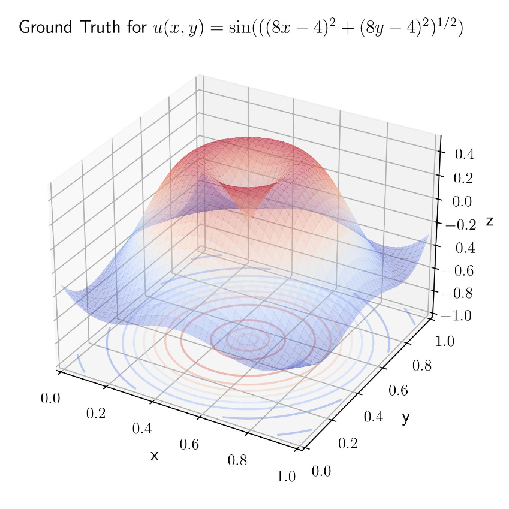
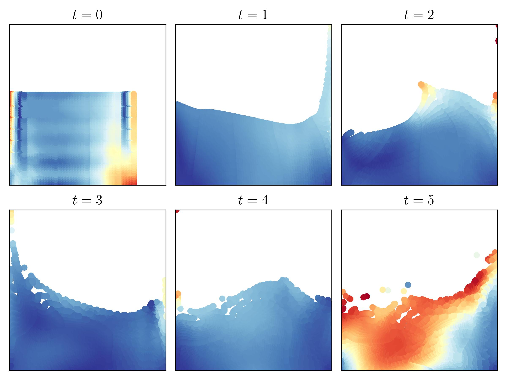

## 📈 Matplotlib Prefab

Matplotlib Prefab is a repository based on matplotlib package, which provides several matplotlib ploting templates for *line plot*, *hist plot*, *scatter plot*, and some complex plottings. You can check the website at [cbhua.github.io/matplotlib-prefab](https://cbhua.github.io/matplotlib-prefab/).

### 💡 Introduction

I have a passion for creating visually appealing figures in publications. During my time writing papers, I often dedicated significant effort to crafting plots. In this repository, I've compiled some of my previous `matplotlib` plotting source code and have designed several templates for convenient reuse. I've chosen not to package this content due to the myriad of customizable parameters. Instead, I believe a template approach is more straightforward to modify and repurpose. I hope these templates inspire you and provide techniques to craft beautiful `matplotlib` figures.

### ⚙️ Environment

I've aimed to keep dependencies to a minimum; thus, a basic combination of `matplotlib` and `numpy` should suffice. However, it's important to note that I've incorporated LaTeX font families and formatting. Therefore, you'll need to have [LaTeX](https://www.latex-project.org/get/) installed on your operating system.

```
Python Version: 3.10 (develop)
Python Package: matplotlib 3.8 (support Latex text), numpy
Other: to use the Latex illustration style, the Latex is required to be installed
```

### 🔦 How to use

You can easily go to the website: [cbhua.github.io/matplotlib-prefab](https://cbhua.github.io/matplotlib-prefab/) and see the example figures of each prefabs:


You can click on the figure to view the associated template code. Most of the code for these figures is self-contained and can be run independently. However, a few require external data. For those instances, please refer to the accompanying notebook.


You can also refer to the `notebook` directory to access Jupyter notebooks for those example figures and tailor them to your needs.

### 🔧 Structure

```
.
├── css - webpage
├── js - webpage
├── pages - webpage
├── vendor - webpage
├── data - some complex figures reauqired external data
├── fig - example figures
├── notebook - jupyter notebook for creating figures
└── *.html - webpage
```

### 🖼 Visualization Example

**Line Plots**: [Jupyter notebook](https://github.com/cbhua/matplotlib-prefab/blob/main/notebook/single-linear.ipynb)






**Hist Plots**: [Jupyter notebook](https://github.com/cbhua/matplotlib-prefab/blob/main/notebook/single-hist.ipynb)




**Scatter Plots**: [Jupyter notebook](https://github.com/cbhua/matplotlib-prefab/blob/main/notebook/single-scatter.ipynb)









**Complex Examples**: [3D Plots jupyter notebook](https://github.com/cbhua/matplotlib-prefab/blob/main/notebook/single-3dplot.ipynb), [Matshow jupyter notebook](https://github.com/cbhua/matplotlib-prefab/blob/main/notebook/multi-matshow.ipynb)






### 📬 Contact

If you have any question or find any bug, feel free to raise an issue. If you have ideas to contribute to this repo, welcome to pull request or contact cbhua@kaist.ac.kr. Thanks for interested to our work!
