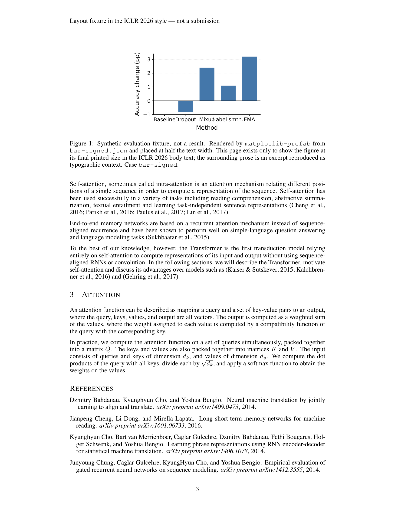
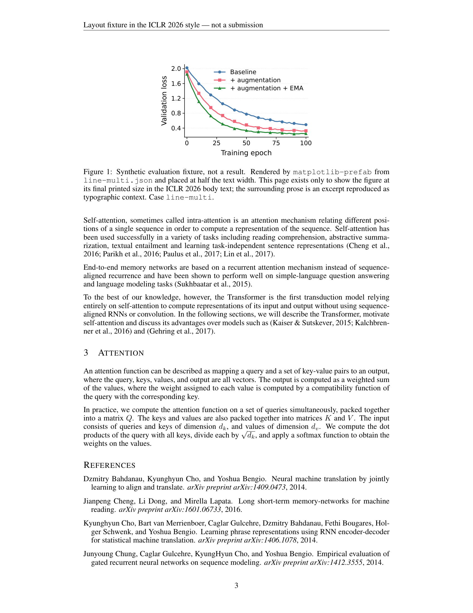
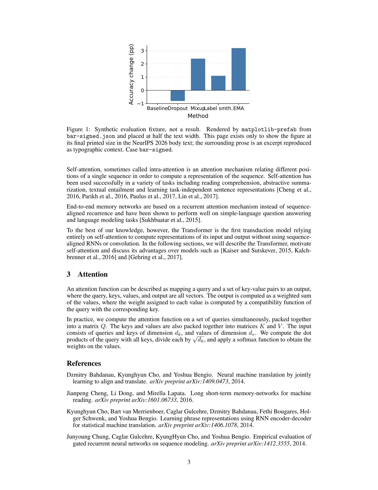
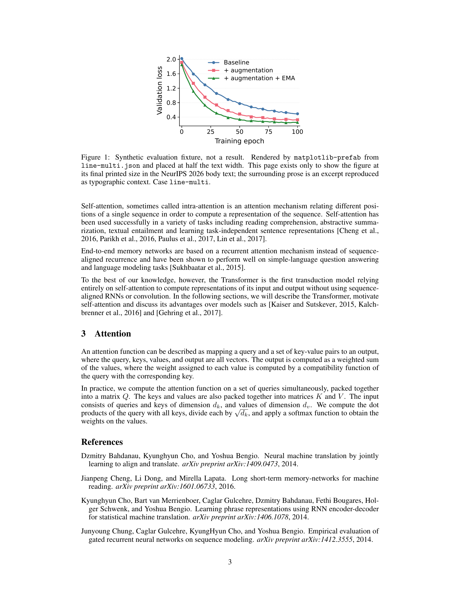
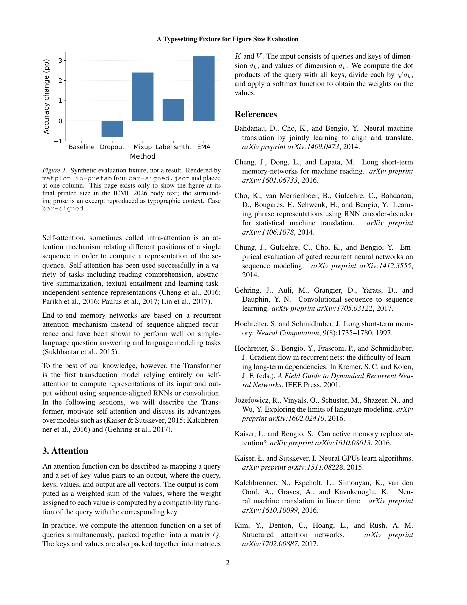
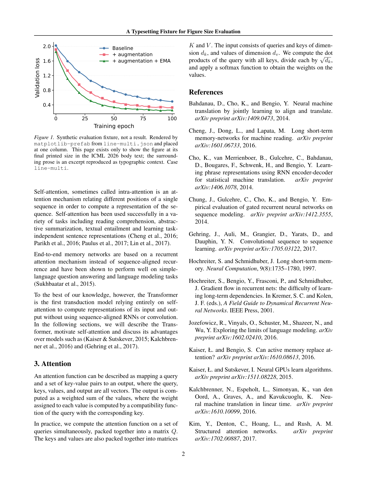
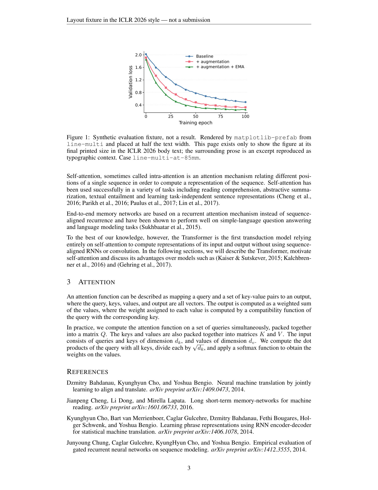

# Figures in real conference pages

Generated by `tests/render_conference_context.py`. **Do not edit by hand.**

Each entry below is one whole body page of a conference template with a figure
from `tests/data/` set into it — the venue's own margins, running head, folio,
caption style and body type, at the width the template gives a figure. This is
the size a reader meets the figure at; `tests/output/index.md` shows the figures
on their own, which is a different question.

The PNGs are 200 DPI rasters and your viewer will scale them to fit, so **do not**
judge printed size from them. The physical numbers in the table are measured
from the compiled PDF's own drawing transform; open `page.pdf` at 100% to see
the real thing.

The style values these pages were produced with are still *provisional* project
choices, not venue requirements. The body text is an excerpt reproduced as
typographic context and credited in
[`tests/fixtures/article-context/provenance.md`](../../fixtures/article-context/provenance.md);
the figures are synthetic evaluation data. None of these pages is a paper, a
submission or an accepted work.

## Summary

| Venue | Case | Line width | Target | Drawn | Scale | Body / caption pt | Page | Status |
| --- | --- | --- | --- | --- | --- | --- | --- | --- |
| ICLR 2026 | [`bar-signed`](iclr2026/bar-signed/) | 139.70 mm | 69.85 mm | 69.85 mm | 1.0000 | 10.0 / 10.0 | 3 of 4 | warn |
| ICLR 2026 | [`line-multi`](iclr2026/line-multi/) | 139.70 mm | 69.85 mm | 69.85 mm | 1.0000 | 10.0 / 10.0 | 3 of 4 | warn |
| NeurIPS 2026 | [`bar-signed`](neurips2026/bar-signed/) | 139.70 mm | 69.85 mm | 69.85 mm | 1.0000 | 10.0 / 10.0 | 3 of 4 | warn |
| NeurIPS 2026 | [`line-multi`](neurips2026/line-multi/) | 139.70 mm | 69.85 mm | 69.85 mm | 1.0000 | 10.0 / 10.0 | 3 of 4 | warn |
| ICML 2026 | [`bar-signed`](icml2026/bar-signed/) | 82.55 mm | 82.55 mm | 82.55 mm | 1.0000 | 10.0 / 9.0 | 2 of 3 | warn |
| ICML 2026 | [`line-multi`](icml2026/line-multi/) | 82.55 mm | 82.55 mm | 82.55 mm | 1.0000 | 10.0 / 9.0 | 2 of 3 | warn |
| ICLR 2026 | [`line-multi-at-85mm`](iclr2026/line-multi-at-85mm/) | 139.70 mm | 69.85 mm | 69.85 mm | 0.8218 | 10.0 / 10.0 | 3 of 4 | warn |

`visual_review` is `not_checked` in every report and stays that way until a
person opens the PNG. A clean compile is not a legible figure.

## ICLR 2026 — bar-signed

Bars crossing zero with named categories — the case where the category labels run out of room first.

ICLR 2026 body, `finalcopy` mode, 1 column(s). Figure width rule: 0.5 * linewidth_at_insertion_point.

| Measurement | Value | Where it came from |
| --- | --- | --- |
| text width | 139.70 mm | `\textwidth`, measured by TeX in the document |
| column width | 139.70 mm | `\columnwidth`, same |
| line width at the float | 139.70 mm | `\linewidth` inside the figure |
| target width | 69.85 mm | line width x 0.5 |
| source figure width | 69.85 mm | the figure PDF's media box |
| drawn width | 69.85 mm | the page's drawing transform |
| scale | 1.0000 | drawn / source |
| body type | 10.0 pt | `\f@size` in body text |
| caption type | 10.0 pt | `\f@size` inside the caption |
| figure axis labels | 9.0 pt drawn -> **9.00 pt** printed | source x scale |
| figure tick labels | 8.0 pt drawn -> **8.00 pt** printed | source x scale |
| figure data lines | 1.20 pt drawn -> **1.200 pt** printed | source x scale |

Checks: 12 pass, 2 warn, 0 fail, 1 not checked.

* **warn** — `latex_boxes`: 1 overfull/underfull box warning(s). Normal in running prose; worth a look only if one names the figure.

What `render.py` itself said about the figure **at this width** — these
are the ones to look at on the page:

* `text_within_canvas` (warn): 1 text element(s) extend past the canvas and will be clipped in the exported files. Shorten the label, rotate tick labels, or raise profile.canvas.width_mm.
* `tick_label_overlap` (warn): 2 neighbouring tick-label pair(s) overlap. This is a bounding-box heuristic: rotate the labels (profile.bar.category_label_rotation_deg), lower profile.axes.max_xticks, shorten the labels, or widen the canvas.

PDF: [`iclr2026/bar-signed/page.pdf`](iclr2026/bar-signed/page.pdf) · Report: [`iclr2026/bar-signed/context-report.json`](iclr2026/bar-signed/context-report.json)

## ICLR 2026 — line-multi

Three series, a legend and dense tick labels — the case where a width reduction shows up first.

ICLR 2026 body, `finalcopy` mode, 1 column(s). Figure width rule: 0.5 * linewidth_at_insertion_point.

| Measurement | Value | Where it came from |
| --- | --- | --- |
| text width | 139.70 mm | `\textwidth`, measured by TeX in the document |
| column width | 139.70 mm | `\columnwidth`, same |
| line width at the float | 139.70 mm | `\linewidth` inside the figure |
| target width | 69.85 mm | line width x 0.5 |
| source figure width | 69.85 mm | the figure PDF's media box |
| drawn width | 69.85 mm | the page's drawing transform |
| scale | 1.0000 | drawn / source |
| body type | 10.0 pt | `\f@size` in body text |
| caption type | 10.0 pt | `\f@size` inside the caption |
| figure axis labels | 9.0 pt drawn -> **9.00 pt** printed | source x scale |
| figure tick labels | 8.0 pt drawn -> **8.00 pt** printed | source x scale |
| figure data lines | 1.20 pt drawn -> **1.200 pt** printed | source x scale |

Checks: 13 pass, 1 warn, 0 fail, 1 not checked.

* **warn** — `latex_boxes`: 1 overfull/underfull box warning(s). Normal in running prose; worth a look only if one names the figure.

PDF: [`iclr2026/line-multi/page.pdf`](iclr2026/line-multi/page.pdf) · Report: [`iclr2026/line-multi/context-report.json`](iclr2026/line-multi/context-report.json)

## NeurIPS 2026 — bar-signed

Bars crossing zero with named categories — the case where the category labels run out of room first.

NeurIPS 2026 body, `final` mode, 1 column(s). Figure width rule: 0.5 * linewidth_at_insertion_point.

| Measurement | Value | Where it came from |
| --- | --- | --- |
| text width | 139.70 mm | `\textwidth`, measured by TeX in the document |
| column width | 139.70 mm | `\columnwidth`, same |
| line width at the float | 139.70 mm | `\linewidth` inside the figure |
| target width | 69.85 mm | line width x 0.5 |
| source figure width | 69.85 mm | the figure PDF's media box |
| drawn width | 69.85 mm | the page's drawing transform |
| scale | 1.0000 | drawn / source |
| body type | 10.0 pt | `\f@size` in body text |
| caption type | 10.0 pt | `\f@size` inside the caption |
| figure axis labels | 9.0 pt drawn -> **9.00 pt** printed | source x scale |
| figure tick labels | 8.0 pt drawn -> **8.00 pt** printed | source x scale |
| figure data lines | 1.20 pt drawn -> **1.200 pt** printed | source x scale |

Checks: 12 pass, 2 warn, 0 fail, 1 not checked.

* **warn** — `latex_boxes`: 1 overfull/underfull box warning(s). Normal in running prose; worth a look only if one names the figure.

What `render.py` itself said about the figure **at this width** — these
are the ones to look at on the page:

* `text_within_canvas` (warn): 1 text element(s) extend past the canvas and will be clipped in the exported files. Shorten the label, rotate tick labels, or raise profile.canvas.width_mm.
* `tick_label_overlap` (warn): 2 neighbouring tick-label pair(s) overlap. This is a bounding-box heuristic: rotate the labels (profile.bar.category_label_rotation_deg), lower profile.axes.max_xticks, shorten the labels, or widen the canvas.

PDF: [`neurips2026/bar-signed/page.pdf`](neurips2026/bar-signed/page.pdf) · Report: [`neurips2026/bar-signed/context-report.json`](neurips2026/bar-signed/context-report.json)

## NeurIPS 2026 — line-multi

Three series, a legend and dense tick labels — the case where a width reduction shows up first.

NeurIPS 2026 body, `final` mode, 1 column(s). Figure width rule: 0.5 * linewidth_at_insertion_point.

| Measurement | Value | Where it came from |
| --- | --- | --- |
| text width | 139.70 mm | `\textwidth`, measured by TeX in the document |
| column width | 139.70 mm | `\columnwidth`, same |
| line width at the float | 139.70 mm | `\linewidth` inside the figure |
| target width | 69.85 mm | line width x 0.5 |
| source figure width | 69.85 mm | the figure PDF's media box |
| drawn width | 69.85 mm | the page's drawing transform |
| scale | 1.0000 | drawn / source |
| body type | 10.0 pt | `\f@size` in body text |
| caption type | 10.0 pt | `\f@size` inside the caption |
| figure axis labels | 9.0 pt drawn -> **9.00 pt** printed | source x scale |
| figure tick labels | 8.0 pt drawn -> **8.00 pt** printed | source x scale |
| figure data lines | 1.20 pt drawn -> **1.200 pt** printed | source x scale |

Checks: 13 pass, 1 warn, 0 fail, 1 not checked.

* **warn** — `latex_boxes`: 1 overfull/underfull box warning(s). Normal in running prose; worth a look only if one names the figure.

PDF: [`neurips2026/line-multi/page.pdf`](neurips2026/line-multi/page.pdf) · Report: [`neurips2026/line-multi/context-report.json`](neurips2026/line-multi/context-report.json)

## ICML 2026 — bar-signed

Bars crossing zero with named categories — the case where the category labels run out of room first.

ICML 2026 body, `accepted` mode, 2 column(s). Figure width rule: 1.0 * linewidth_at_insertion_point.

| Measurement | Value | Where it came from |
| --- | --- | --- |
| text width | 171.45 mm | `\textwidth`, measured by TeX in the document |
| column width | 82.55 mm | `\columnwidth`, same |
| line width at the float | 82.55 mm | `\linewidth` inside the figure |
| target width | 82.55 mm | line width x 1.0 |
| source figure width | 82.55 mm | the figure PDF's media box |
| drawn width | 82.55 mm | the page's drawing transform |
| scale | 1.0000 | drawn / source |
| body type | 10.0 pt | `\f@size` in body text |
| caption type | 9.0 pt | `\f@size` inside the caption |
| figure axis labels | 9.0 pt drawn -> **9.00 pt** printed | source x scale |
| figure tick labels | 8.0 pt drawn -> **8.00 pt** printed | source x scale |
| figure data lines | 1.20 pt drawn -> **1.200 pt** printed | source x scale |

Checks: 13 pass, 1 warn, 0 fail, 1 not checked.

* **warn** — `latex_boxes`: 9 overfull/underfull box warning(s). Normal in running prose; worth a look only if one names the figure.

PDF: [`icml2026/bar-signed/page.pdf`](icml2026/bar-signed/page.pdf) · Report: [`icml2026/bar-signed/context-report.json`](icml2026/bar-signed/context-report.json)

## ICML 2026 — line-multi

Three series, a legend and dense tick labels — the case where a width reduction shows up first.

ICML 2026 body, `accepted` mode, 2 column(s). Figure width rule: 1.0 * linewidth_at_insertion_point.

| Measurement | Value | Where it came from |
| --- | --- | --- |
| text width | 171.45 mm | `\textwidth`, measured by TeX in the document |
| column width | 82.55 mm | `\columnwidth`, same |
| line width at the float | 82.55 mm | `\linewidth` inside the figure |
| target width | 82.55 mm | line width x 1.0 |
| source figure width | 82.55 mm | the figure PDF's media box |
| drawn width | 82.55 mm | the page's drawing transform |
| scale | 1.0000 | drawn / source |
| body type | 10.0 pt | `\f@size` in body text |
| caption type | 9.0 pt | `\f@size` inside the caption |
| figure axis labels | 9.0 pt drawn -> **9.00 pt** printed | source x scale |
| figure tick labels | 8.0 pt drawn -> **8.00 pt** printed | source x scale |
| figure data lines | 1.20 pt drawn -> **1.200 pt** printed | source x scale |

Checks: 13 pass, 1 warn, 0 fail, 1 not checked.

* **warn** — `latex_boxes`: 9 overfull/underfull box warning(s). Normal in running prose; worth a look only if one names the figure.

PDF: [`icml2026/line-multi/page.pdf`](icml2026/line-multi/page.pdf) · Report: [`icml2026/line-multi/context-report.json`](icml2026/line-multi/context-report.json)

## ICLR 2026 — line-multi-at-85mm

Regression case: the committed 85 mm figure placed into ICLR's half-width slot with no re-render. Expected to warn — it exists to show the scale factor and the reduced effective type sizes are really measured, not assumed.

ICLR 2026 body, `finalcopy` mode, 1 column(s). Figure width rule: 0.5 * linewidth_at_insertion_point.

| Measurement | Value | Where it came from |
| --- | --- | --- |
| text width | 139.70 mm | `\textwidth`, measured by TeX in the document |
| column width | 139.70 mm | `\columnwidth`, same |
| line width at the float | 139.70 mm | `\linewidth` inside the figure |
| target width | 69.85 mm | line width x 0.5 |
| source figure width | 85.00 mm | the figure PDF's media box |
| drawn width | 69.85 mm | the page's drawing transform |
| scale | 0.8218 | drawn / source |
| body type | 10.0 pt | `\f@size` in body text |
| caption type | 10.0 pt | `\f@size` inside the caption |
| figure axis labels | 9.0 pt drawn -> **7.40 pt** printed | source x scale |
| figure tick labels | 8.0 pt drawn -> **6.57 pt** printed | source x scale |
| figure data lines | 1.20 pt drawn -> **0.986 pt** printed | source x scale |

Checks: 11 pass, 2 warn, 0 fail, 2 not checked.

* **warn** — `latex_boxes`: 1 overfull/underfull box warning(s). Normal in running prose; worth a look only if one names the figure.
* **warn** — `effective_type_size`: Placed at scale 0.8218: 9.0 pt axis labels print at 7.40 pt, 8.0 pt ticks at 6.57 pt, 1.20 pt data lines at 0.986 pt. Whether that is legible is a judgement, not a rule — this check reports the numbers and does not set a threshold.

PDF: [`iclr2026/line-multi-at-85mm/page.pdf`](iclr2026/line-multi-at-85mm/page.pdf) · Report: [`iclr2026/line-multi-at-85mm/context-report.json`](iclr2026/line-multi-at-85mm/context-report.json)
