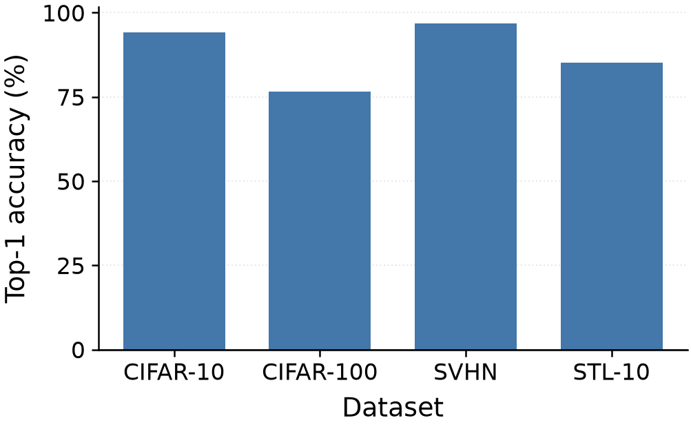
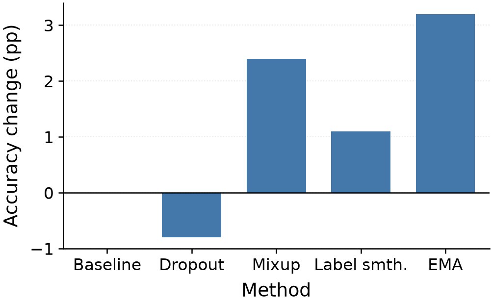
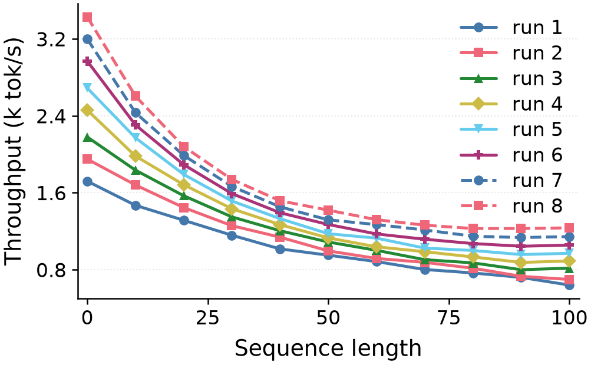
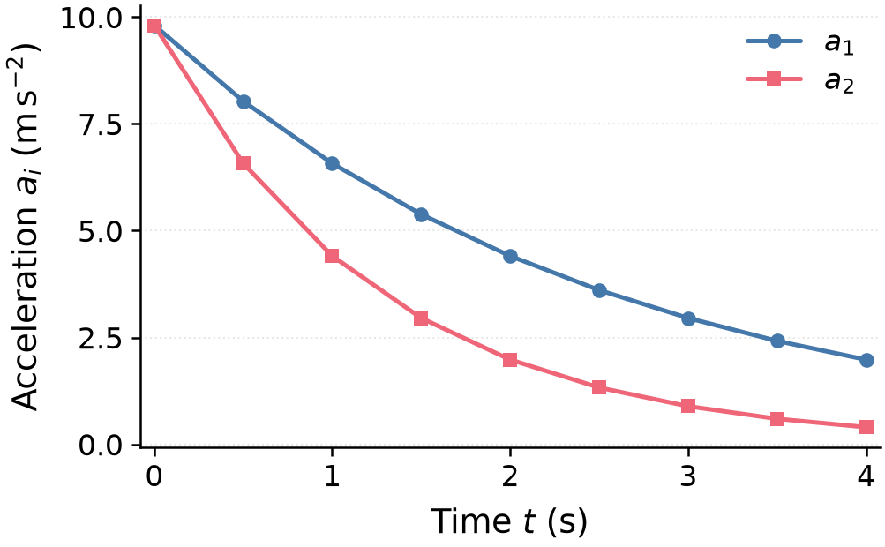
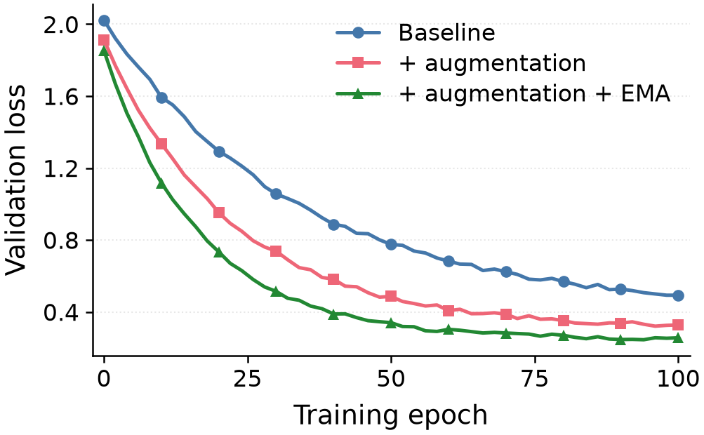
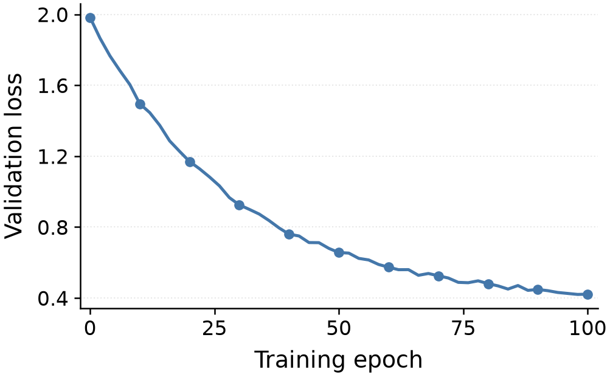
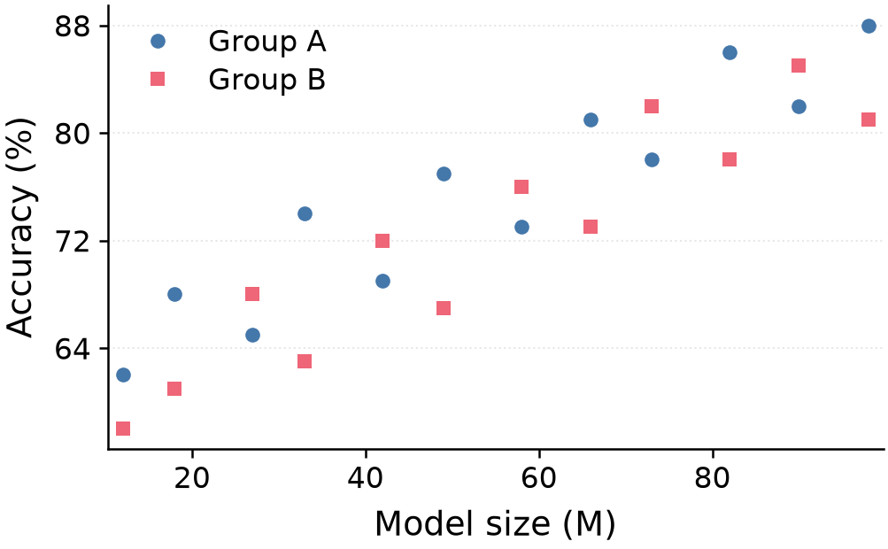

# Style proof sheet

Generated by `tests/render_gallery.py`. **Do not edit by hand** — edit the
profile and re-run the script.

Every value below is *provisional*: an initial project choice, not a journal or
conference requirement. Change one, re-run, and compare the pictures.

Profile: [`skills/scientific-figures/references/profiles/single-column.json`](../../skills/scientific-figures/references/profiles/single-column.json)

| Key | Value |
| --- | --- |
| `canvas.width_mm` | 85.0 |
| `canvas.aspect_ratio` | 0.618 |
| `derived height (mm)` | 52.53 |
| `fonts.family` | DejaVu Sans |
| `fonts.size_axis_label_pt` | 9.0 |
| `fonts.size_tick_pt` | 8.0 |
| `fonts.size_legend_pt` | 8.0 |
| `lines.data_linewidth_pt` | 1.2 |
| `lines.axes_linewidth_pt` | 0.6 |
| `lines.marker_size_pt` | 4.0 |
| `bar.width_fraction` | 0.7 |
| `output.png_dpi` | 300 |

Environment: matplotlib 3.11.1, Python 3.12.13.

The PNGs below are 300 DPI previews, so on screen they are roughly four times
the printed size. Judge legibility accordingly, or open the PDF at 100%.

## bar-positive

All-positive bars: they sit exactly on the baseline, one colour for the one series, bar width and category label spacing.

Checks: 14 pass, 0 warn, 0 fail, 1 not checked (`visual_review` is always the last of those — no script can close it).

Spec: [`tests/data/bar-positive.json`](../data/bar-positive.json) · PDF: [`bar-positive/figure.pdf`](bar-positive/figure.pdf) · Report: [`bar-positive/report.json`](bar-positive/report.json)

## bar-signed

Bars crossing zero: the zero line, symmetric padding, and a zero-valued category that must still be visible as a category.

Checks: 14 pass, 0 warn, 0 fail, 1 not checked (`visual_review` is always the last of those — no script can close it).

Spec: [`tests/data/bar-signed.json`](../data/bar-signed.json) · PDF: [`bar-signed/figure.pdf`](bar-signed/figure.pdf) · Report: [`bar-signed/report.json`](bar-signed/report.json)

## line-many

Eight series: colours 1-6, then colours 1-2 again with the dash pattern taking over. Check that series 7 and 8 stay separable from 1 and 2.

Checks: 14 pass, 0 warn, 0 fail, 1 not checked (`visual_review` is always the last of those — no script can close it).

Spec: [`tests/data/line-many.json`](../data/line-many.json) · PDF: [`line-many/figure.pdf`](line-many/figure.pdf) · Report: [`line-many/report.json`](line-many/report.json)

## line-mathtext

Mathtext labels and legend entries. Variables italic, units upright, no LaTeX installation involved.

Checks: 14 pass, 0 warn, 0 fail, 1 not checked (`visual_review` is always the last of those — no script can close it).

Spec: [`tests/data/line-mathtext.json`](../data/line-mathtext.json) · PDF: [`line-mathtext/figure.pdf`](line-mathtext/figure.pdf) · Report: [`line-mathtext/report.json`](line-mathtext/report.json)

## line-multi

Three series: the first three palette colours, their bound marker shapes, and legend placement and size.

Checks: 14 pass, 0 warn, 0 fail, 1 not checked (`visual_review` is always the last of those — no script can close it).

Spec: [`tests/data/line-multi.json`](../data/line-multi.json) · PDF: [`line-multi/figure.pdf`](line-multi/figure.pdf) · Report: [`line-multi/report.json`](line-multi/report.json)

## line-single

One series: line width, marker size and spacing, tick and axis-label sizes. No legend, because a single series names itself in the y label.

Checks: 14 pass, 0 warn, 0 fail, 1 not checked (`visual_review` is always the last of those — no script can close it).

Spec: [`tests/data/line-single.json`](../data/line-single.json) · PDF: [`line-single/figure.pdf`](line-single/figure.pdf) · Report: [`line-single/report.json`](line-single/report.json)

## scatter

Two groups of unconnected samples: marker size, marker shapes, colour separation and legend scale. Every sample remains visible; no line or thinning.

Checks: 14 pass, 0 warn, 0 fail, 1 not checked (`visual_review` is always the last of those — no script can close it).

Spec: [`tests/data/scatter.json`](../data/scatter.json) · PDF: [`scatter/figure.pdf`](scatter/figure.pdf) · Report: [`scatter/report.json`](scatter/report.json)
